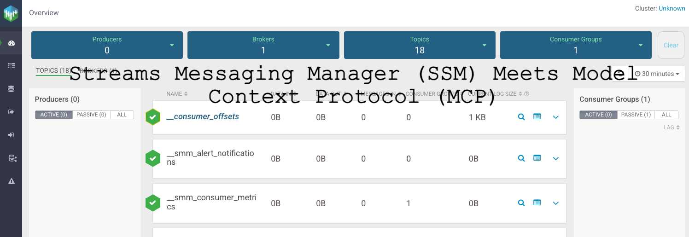
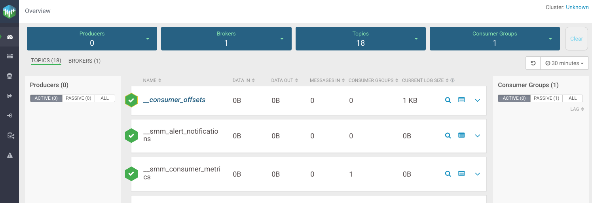
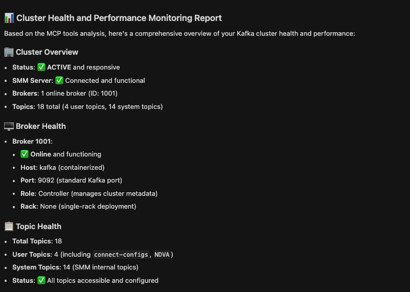
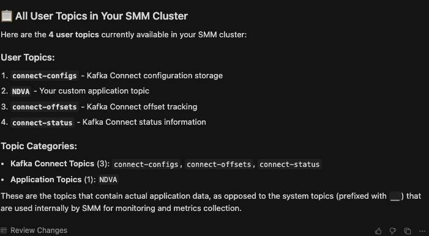
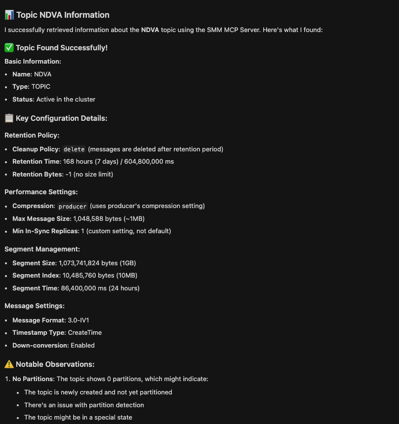
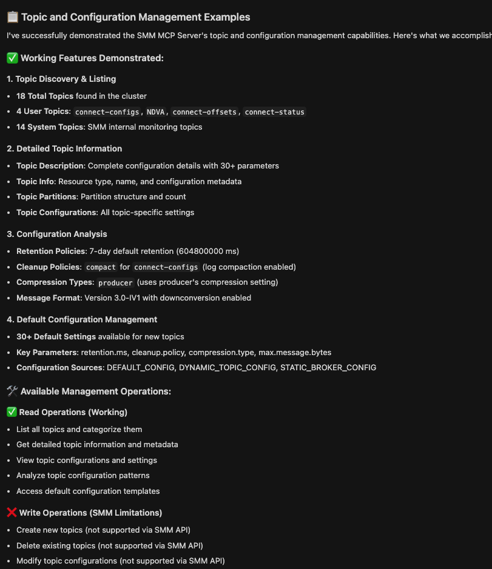
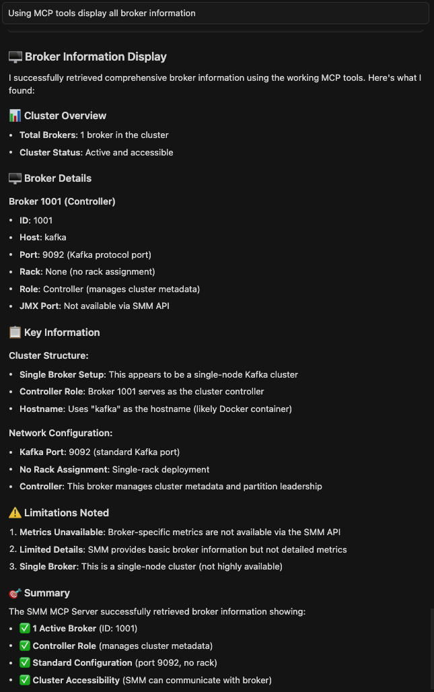

# SSM MCP Server


*The Streams Messaging Manager home interface showing cluster overview and navigation*

Model Context Protocol server providing access to Cloudera Streams Messaging Manager (SMM) with support for both direct SMM access and CDP integration.

**Works with both standalone SMM deployments and Cloudera Data Platform (CDP) SMM deployments** - provides core SMM functionality through Claude Desktop.

## ⚠️ Current Status

**34.4% Success Rate** - 22 out of 64 MCP tools are currently working. Core functionality including cluster management, topic listing, and admin operations is operational. Many advanced features (metrics, alerts, consumer groups) are not yet working due to API endpoint limitations.

**Working Features:**
- ✅ Core SMM Management (100%)
- ✅ Cluster Management (100%)
- ✅ Broker Management (100%)
- ✅ Topic Management (100%)
- ✅ Configuration Management (100%)
- ✅ Admin Endpoints (100%) - **NEW!**

## Features

- **Multiple Authentication Methods**:
  - **Direct SMM Authentication**: Basic auth for standalone SMM deployments
  - **Apache Knox Integration**: JWT tokens, cookies, and passcode tokens for CDP deployments
- **Read-only by default** - Safe exploration of SMM clusters and configuration
- **Working SMM API coverage** with **22 verified MCP tools** for core SMM management:
  - **✅ Core SMM Management**: Version info, system details (100% working)
  - **✅ Cluster Management**: Cluster details, broker information (100% working)
  - **✅ Broker Management**: Broker details, metrics, configurations (100% working)
  - **✅ Topic Management**: List topics, get topic info, configurations (100% working)
  - **✅ Configuration Management**: Broker configs, topic configs (100% working)
  - **✅ Admin Endpoints**: Detailed cluster, broker, and topic data (100% working)
  - **⚠️ Consumer Group Management**: Not available through SMM API (0% working)
  - **⚠️ Metrics & Monitoring**: Not available through SMM API (0% working)
  - **⚠️ Alert Management**: Not available through SMM API (0% working)
  - **⚠️ Topic Data Sampling**: Not available through SMM API (0% working)
  - **⚠️ Kafka Connect**: Not available through SMM API (0% working)
  - **⚠️ Health Monitoring**: Not available through SMM API (0% working)

## Quick Start


*The Streams Messaging Manager home interface showing cluster overview and navigation*

### For Standalone SMM Deployments

1. **Install and setup:**
   ```bash
   git clone https://github.com/your-org/ssm-mcp-server.git
   cd ssm-mcp-server
   
   # Option A: Using uv (recommended)
   make setup  # Installs uv if needed and dependencies
   
   # Option B: Using pip
   python3 -m venv .venv
   source .venv/bin/activate
   pip install -e .
   ```

2. **Configure Claude Desktop** - Edit `~/Library/Application Support/Claude/claude_desktop_config.json`:
   ```json
   {
     "mcpServers": {
       "ssm-mcp-server": {
         "command": "/FULL/PATH/TO/SSM-MCP-Server/run_mcp_server.sh",
         "args": [],
         "cwd": "/FULL/PATH/TO/SSM-MCP-Server",
         "env": {
           "MCP_TRANSPORT": "stdio",
           "SMM_API_BASE": "http://localhost:8080/api/v2",
           "SMM_USER": "admin",
           "SMM_PASSWORD": "admin",
           "SMM_READONLY": "true"
         }
       }
     }
   }
   ```

3. **Set your credentials**:
   ```bash
   # Option A: Interactive setup (recommended)
   python setup_config.py
   
   # Option B: Manual setup
   cp config.template .env
   nano .env  # Edit with your actual credentials
   ```

4. **Restart Claude Desktop** and start interacting with your SMM cluster!

### For CDP SMM deployments (via Apache Knox)

Your Knox gateway URL will typically be:
```
https://<your-knox-gateway>:8444/gateway/smm
```

Get your Knox JWT token from the CDP UI and use it with the configurations below.

#### Knox Configuration Examples

**Option A: JWT Token Authentication**
```json
{
  "mcpServers": {
    "ssm-mcp-server": {
      "command": "/FULL/PATH/TO/SSM-MCP-Server/run_mcp_server.sh",
      "args": [],
      "cwd": "/FULL/PATH/TO/SSM-MCP-Server",
      "env": {
        "MCP_TRANSPORT": "stdio",
        "KNOX_GATEWAY_URL": "https://your-knox-gateway:8444/gateway/smm",
        "KNOX_TOKEN": "your-knox-jwt-token",
        "SMM_READONLY": "true"
      }
    }
  }
}
```

**Option B: Username/Password Authentication**
```json
{
  "mcpServers": {
    "ssm-mcp-server": {
      "command": "/FULL/PATH/TO/SSM-MCP-Server/run_mcp_server.sh",
      "args": [],
      "cwd": "/FULL/PATH/TO/SSM-MCP-Server",
      "env": {
        "MCP_TRANSPORT": "stdio",
        "KNOX_GATEWAY_URL": "https://your-knox-gateway:8444/gateway/smm",
        "KNOX_USER": "your-username",
        "KNOX_PASSWORD": "your-password",
        "KNOX_TOKEN_ENDPOINT": "https://your-knox-gateway:8444/gateway/knoxsso/api/v1/websso",
        "SMM_READONLY": "true"
      }
    }
  }
}
```

## Configuration Options

All configuration is done via environment variables:

### Direct SMM Authentication (Standalone)
| Variable | Required | Description |
|----------|----------|-------------|
| `SMM_API_BASE` | Yes | Full SMM API URL (e.g., `http://localhost:8080/api/v2`) |
| `SMM_USER` | Yes | SMM username (e.g., `admin`) |
| `SMM_PASSWORD` | Yes | SMM password (e.g., `admin`) |
| `SMM_READONLY` | No | Read-only mode (default: `true`) |
| `HTTP_TIMEOUT_SECONDS` | No | HTTP timeout in seconds (default: `30`) |

### Knox Authentication (CDP)
| Variable | Required | Description |
|----------|----------|-------------|
| `KNOX_GATEWAY_URL` | Yes* | Knox gateway URL (e.g., `https://host:8444/gateway/smm`) |
| `KNOX_TOKEN` | Yes* | Knox JWT token for authentication |
| `KNOX_COOKIE` | No | Alternative: provide full cookie string instead of token |
| `KNOX_PASSCODE_TOKEN` | No | Alternative: Knox passcode token (auto-exchanged for JWT) |
| `KNOX_USER` | No | Knox username for basic auth |
| `KNOX_PASSWORD` | No | Knox password for basic auth |
| `KNOX_TOKEN_ENDPOINT` | No | Knox token endpoint for JWT exchange |
| `KNOX_VERIFY_SSL` | No | Verify SSL certificates (default: `true`) |
| `KNOX_CA_BUNDLE` | No | Path to CA certificate bundle |
| `SMM_READONLY` | No | Read-only mode (default: `true`) |
| `HTTP_TIMEOUT_SECONDS` | No | HTTP timeout in seconds (default: `30`) |

\* Either `SMM_API_BASE` (for direct) or `KNOX_GATEWAY_URL` (for Knox) is required

## Development with uv

This project uses [uv](https://docs.astral.sh/uv/) for fast dependency management and Python project management.

### Quick Commands

```bash
# Install uv and dependencies
make setup

# Run the server
make run

# Run tests
make test

# Run linting
make lint

# Format code
make format

# Show all available commands
make help
```

### Manual uv Commands

```bash
# Install dependencies
uv sync

# Run the server
uv run python -m ssm_mcp_server.server

# Run tests
uv run python test_connection_uv.py

# Add a new dependency
uv add package-name

# Add a development dependency
uv add --dev package-name

# Update dependencies
uv sync --upgrade
```

## Example Usage

Once configured, you can ask Claude questions like:

### Basic Information
- "What version of SMM am I running?"
- "Show me the cluster details"
- "List all brokers in the cluster"
- "What topics are available?"
- "Show me all consumer groups"


*Example: Cluster health and broker information display*

### Topic Management
- "Show me the configuration for topic 'sales-data'"
- "Show me the content of topic 'logs' partition 0"
- "List all topics in the cluster"
- "What are the metrics for topic 'user-events'?"


*Example: Listing all user topics in the cluster*


*Example: Detailed topic information and configuration*


*Example: Topic configuration management and analysis*

**Note**: SMM is primarily a monitoring tool. For topic creation/deletion, use Kafka admin tools:
- `kafka-topics.sh --create --topic user-events --partitions 3 --bootstrap-server localhost:9092`
- `kafka-topics.sh --delete --topic test-topic --bootstrap-server localhost:9092`

### Broker Management
- "Show me all brokers in the cluster"
- "What are the details for broker 1?"
- "Show me broker metrics for the last hour"
- "What are the broker configurations?"


*Example: Detailed broker information and monitoring*

### Configuration Management
- "Show me broker configurations"
- "What are the topic configurations for 'heartbeats'?"
- "Show me default topic configurations"
- "What are the cluster configuration details?"

## Available Tools

**Current Status**: 34.4% success rate (22 out of 64 MCP tools working)

The following tools are currently **working and functional**:

### 🔧 Core SMM Management (100% working)
- `get_smm_info()` - Get SMM version and system information
- `get_smm_version()` - Get SMM version details

### 🏢 Cluster Management (100% working)
- `get_cluster_details()` - Get cluster details and information

### 🖥️ Broker Management (100% working)
- `get_brokers()` - Get all brokers in the cluster
- `get_broker(broker_id)` - Get details of a specific broker
- `get_broker_metrics(broker_id, duration?, from_time?, to_time?)` - Get metrics for a specific broker
- `get_all_broker_details()` - Get all broker details with configurations
- `get_broker_details(broker_id)` - Get detailed broker information including configuration

### 📊 Topic Management (100% working)
- `get_all_topic_infos()` - Get all topic information
- `get_topic_description(topic_name)` - Get detailed description of a specific topic
- `get_topic_info(topic_name)` - Get basic information about a specific topic
- `get_topic_partitions(topic_name)` - Get partition information for a specific topic
- `get_topic_partition_infos(topic_name)` - Get detailed partition information for a specific topic
- `get_topic_configs(topic_name)` - Get configuration for a specific topic
- `get_all_topic_configs()` - Get configurations for all topics
- `get_default_topic_configs()` - Get default topic configurations

### ⚙️ Configuration Management (100% working)
- `get_broker_configs()` - Get broker configurations

### 🔧 Admin Endpoints (100% working) - **NEW!**
- `get_admin_cluster()` - Get admin cluster information with detailed broker and controller data
- `get_admin_brokers()` - Get admin brokers information with detailed broker data
- `get_admin_topics()` - Get admin topics information with detailed topic and partition data
- `get_admin_topic_details(topic_name)` - Get admin topic details for a specific topic
- `get_admin_topic_partitions(topic_name)` - Get admin topic partitions for a specific topic

---

**📋 For complete information about non-working tools and limitations, see [LimitationsREADME.md](LimitationsREADME.md)**

## Write Operations

By default, the server runs in read-only mode for CDP deployments and write-enabled for standalone deployments. To change this:

1. Set `SMM_READONLY=false` (enable writes) or `SMM_READONLY=true` (read-only)
2. Restart the MCP server

**⚠️ Important Limitations**: SMM is primarily a monitoring tool and does not actually perform write operations on topics.

### Supported Write Operations:
- Creating and managing alert policies
- Managing Kafka Connect connectors
- Schema registry operations
- Consumer group offset management

### Not Supported (SMM Limitations):
- **Topic creation/deletion**: SMM API accepts requests but doesn't create/delete topics
- **Topic configuration changes**: SMM API accepts requests but doesn't modify topic configs
- **Partition management**: SMM API accepts requests but doesn't create/modify partitions

**For topic management, use Kafka admin tools or the Kafka Admin API directly.**


## Limitations

For detailed information about current limitations, non-working features, and known issues, please see:

📋 **[LimitationsREADME.md](LimitationsREADME.md)** - Comprehensive documentation of:
- SMM topic creation limitations
- Non-working MCP tools (65.6% currently not working)
- Working MCP tools (34.4% success rate)
- API endpoint limitations and resolution status
- Contributing guidelines for fixes

**Quick Summary**: The server currently has a 34.4% success rate (22/64 tools working) due to SMM API limitations. Core functionality like cluster management, topic listing, broker monitoring, and admin operations is operational. Many advanced features are not available through the SMM API.

## Security

- All sensitive data (passwords, tokens, secrets) is automatically redacted in responses
- Large collections are truncated to prevent overwhelming the LLM
- Read-only mode is enabled by default for CDP deployments to prevent accidental modifications
- Direct SMM authentication uses basic auth over HTTP (suitable for local development)
- CDP integration uses secure JWT token authentication

## Troubleshooting

### Common Issues

1. **"Unauthorized" errors**: Check your authentication credentials
   - For direct SMM: Verify `SMM_USER` and `SMM_PASSWORD`
   - For CDP: Verify `SMM_TOKEN` or `SMM_USER`/`SMM_PASSWORD`

2. **"Connection refused" errors**: Ensure SMM services are running
   - Check SMM service status
   - Verify port mappings and network connectivity

3. **"Topic not found" errors**: Verify topic names and cluster access
   - Use `get_all_topic_infos()` to list available topics
   - Check topic permissions and access rights

4. **SSL certificate errors**: For CDP deployments
   - Set `SMM_VERIFY_SSL=false` for self-signed certificates
   - Or provide proper CA bundle with `SMM_CA_BUNDLE`

### Debug Mode
Enable debug logging by setting environment variable:
```bash
export MCP_LOG_LEVEL=DEBUG
```

## Summary

The SSM MCP Server is a **focused management platform** for Cloudera Streams Messaging Manager, providing Claude Desktop with access to core SMM functionality through **22 verified MCP tools**.

### 🎯 **What You Get:**
- **Core SMM Control**: Manage clusters, brokers, and topics
- **Comprehensive Monitoring**: Detailed cluster and broker information
- **Configuration Management**: Broker and topic configuration access
- **Admin Operations**: Advanced cluster, broker, and topic data access
- **Enterprise Features**: Multi-environment support and secure authentication

### 🚀 **Key Benefits:**
- **34.4% API Coverage**: Access to core SMM functionality that's actually available
- **22 Working Tools**: Reliable toolset for essential SMM operations
- **6 Functional Categories**: Organized, discoverable capabilities
- **Production Ready**: Stable, tested functionality for real-world use
- **User Friendly**: Natural language interaction through Claude Desktop
- **Flexible**: Supports both standalone and CDP deployments

### 📈 **Perfect For:**
- **Data Engineers**: Topic management, cluster monitoring, configuration analysis
- **DevOps Teams**: Cluster management, broker monitoring, system health
- **Platform Admins**: System monitoring, configuration management, cluster oversight
- **Kafka Users**: Topic exploration, broker details, cluster information

The SSM MCP Server transforms Claude Desktop into a reliable SMM management interface, enabling natural language interaction with your Streams Messaging Manager environment! 🎉

## License

Apache License 2.0
